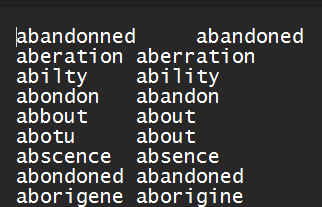
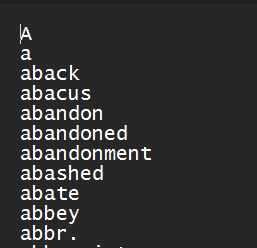
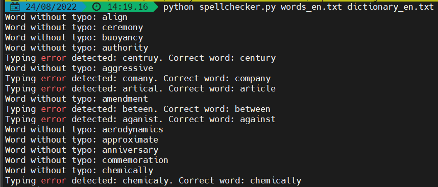
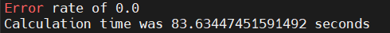

# Spell Checker
A simple Spell Checker using Levenshtein Distance

## How to execute:

* You need a file with Typos and their correct word

* You need a dictionary with correct words

To execute type this:
* python spellchecker.py words_en.txt dictionary_en.txt

## How does it look in execution

